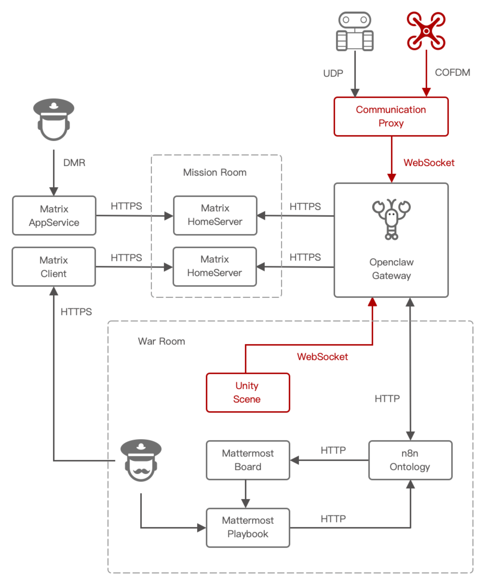

# Integrate Crazyflie Drone with Unity Game Engine

## 1. Objective

This project integrates [Crazyflie 2.1_drone](https://www.bitcraze.io/products/crazyflie-2-1-brushless/) 
with [Unity6 game engine](https://unity.com/releases/unity-6). 
We use Unity6 as the controller of the Crazyflie2.1, to receive the drone's telemetry and its video stream, 
and to send commands to control the movement of the drone. 

&nbsp;
## 2. Hardware

We bought a Crazyflie 2.1 hardware kit from 
[a Taobao store named DinosaurTech](https://item.taobao.com/item.htm?id=985921221709). 
The kit includes four components, with a total cost of US$230.

It is quite straightforward to [assemble the Crazyflie 2.1](https://www.bitcraze.io/documentation/tutorials/getting-started-with-crazyflie-brushless/), 
with well-written documentation. 

It is also very easy to use Python to use radio to 
[communicate with the Crazyflie 2.1](https://www.bitcraze.io/documentation/repository/crazyflie-lib-python/master/user-guides/sbs_connect_log_param/), 
and control its movement.

~~~
1 * crazyflie2.1
1 * flow deck for navigation
1 * crazyradio PA
1 * esp32s3_AI_deck
~~~

   

     
     &nbsp;
     
   
  
   

     
     &nbsp;
     
   
  

&nbsp;
## 3. ESP32s3 AI Deck

While the native Crazyflie 2.1 setup (using Crazyradio PA and `cflib` python package) is user-friendly, it lacks video streaming capability and wifi connectivity.

[`ESP-Drone`](https://docs.espressif.com/projects/espressif-esp-drone/en/latest/gettingstarted.html)
provides a viable solution for Wi-Fi communication and video streaming. 
In addition, the Taobao store "DinosaurTech" offers an experimental accessory named 
[`ESP32-S3 AI Deck`](https://github.com/bitdeckai/esp32s3_ai_deck).

However, installing and configuring `ESP-Drone` and `ESP32-S3 AI Deck` is not straightforward.
We followed this procedure and finally got it working after several attempts.

&nbsp;
### 3.1 Install ESP-IDF

We followed the official guide to 
[install ESP32s3-IDF](https://docs.espressif.com/projects/esp-idf/en/stable/esp32s3/get-started/linux-setup.html)
in offline mode. 

1. Install `ESP-EIM`
   
   ~~~
   robot@robot-test:~$ uname -a
   Linux robot-test 6.8.0-110-generic #110~22.04.1-Ubuntu SMP PREEMPT_DYNAMIC Fri Mar 27 12:43:08 UTC  x86_64 x86_64 x86_64 GNU/Linux
   
   robot@robot-test:~$ echo "deb [trusted=yes] https://dl.espressif.com/dl/eim/apt/ stable main" | sudo tee /etc/apt/sources.list.d/espressif.list
   
   robot@robot-test:~$ sudo apt update
   robot@robot-test:~$ sudo apt install eim
   ~~~

2. Download `ESP-IDF` 
   
   Following the official guide to download the `archive_vv5.2.6_linux-x64.zst`.

3. Install `ESP-IDF`
   
   ~~~
   robot@robot-test:~$ eim install --use-local-archive /home/robot/crazyflie/archive_vv5.2.6_linux-x64.zst
   ...
   You have successfully installed ESP-IDF
   for using the ESP-IDF tools inside the terminal, you will find activation scripts inside the base install folder
   sourcing the activation script will setup environment in the current terminal session
   ============================================
   to activate the environment, run the following command in your terminal:
          source "/home/robot/.espressif/tools/activate_idf_v5.2.6.sh"
   ============================================
   ...
   ~~~

4. Setup `ESP-IDF` environment
   
   ~~~
   robot@robot-test:~/crazyflie$ pwd
   /home/robot/crazyflie
   
   robot@robot-test:~/crazyflie$ echo $ESP_IDF_VERSION
   <show nothing>
   
   robot@robot-test:~/crazyflie$ source "/home/robot/.espressif/tools/activate_idf_v5.2.6.sh"
   ...
   Added environment variable ESP_IDF_VERSION = 5.2
   Added environment variable IDF_TOOLS_PATH = /home/robot/.espressif/tools
   Added environment variable IDF_COMPONENT_LOCAL_STORAGE_URL = file:///home/robot/.espressif/tools
   Added environment variable IDF_PATH = /home/robot/.espressif/v5.2.6/esp-idf
   Added environment variable ESP_ROM_ELF_DIR = /home/robot/.espressif/tools/esp-rom-elfs/20240305
   Added environment variable OPENOCD_SCRIPTS = /home/robot/.espressif/tools/openocd-esp32/v0.12.0-esp32-20250707/openocd-esp32/share/openocd/scripts
   Added environment variable IDF_PYTHON_ENV_PATH = /home/robot/.espressif/tools/python/v5.2.6/venv
   Added proper directory to PATH
   Activated virtual environment at /home/robot/.espressif/tools/python/v5.2.6/venv
   Environment setup complete for the current shell session.
   These changes will be lost when you close this terminal.
   You are now using IDF version 5.2.
   eim select v5.2.6
   
   (venv) robot@robot-test:~/crazyflie$ deactivate
   robot@robot-test:~/crazyflie$ 
   
   robot@robot-test:~/crazyflie$ echo $ESP_IDF_VERSION
   5.2
   
   robot@robot-test:~/crazyflie$ echo $IDF_PATH
   /home/robot/.espressif/v5.2.6/esp-idf
   
   robot@robot-test:~/crazyflie$ echo $IDF_TOOLS_PATH
   /home/robot/.espressif/tools
   
   robot@robot-test:~/crazyflie$ echo $OPENOCD_SCRIPTS
   /home/robot/.espressif/tools/openocd-esp32/v0.12.0-esp32-20250707/openocd-esp32/share/openocd/scripts
   
   robot@robot-test:~/crazyflie$ echo $IDF_PYTHON_ENV_PATH
   /home/robot/.espressif/tools/python/v5.2.6/venv
   ~~~

5. Create conda env

   ~~~
   robot@robot-test:~/crazyflie$ conda create --name crazyflie python=3.14
   robot@robot-test:~/crazyflie$ conda activate crazyflie

   (crazyflie) robot@robot-test:~/crazyflie/webrtc$ python --version
   Python 3.14.3
   ~~~

&nbsp;
### 3.2 Install ESP32-S3 AI Deck
