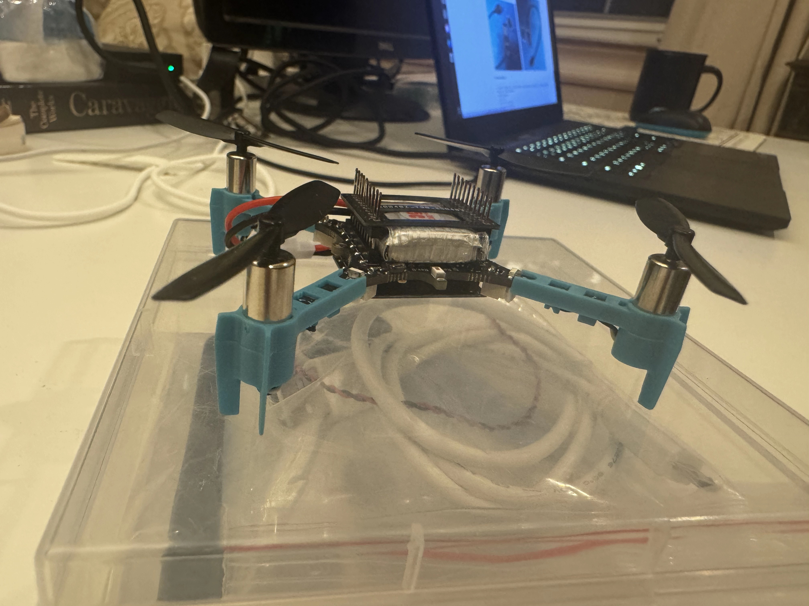
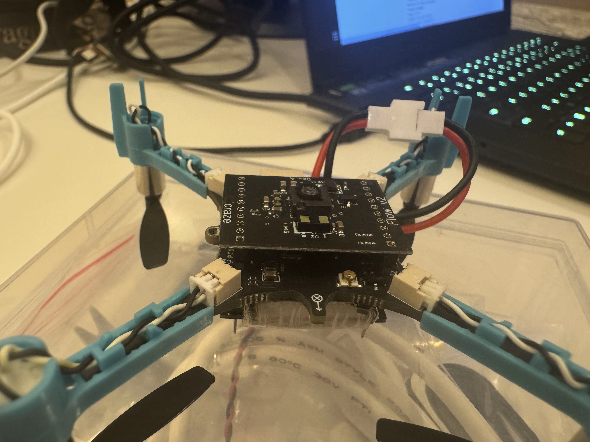
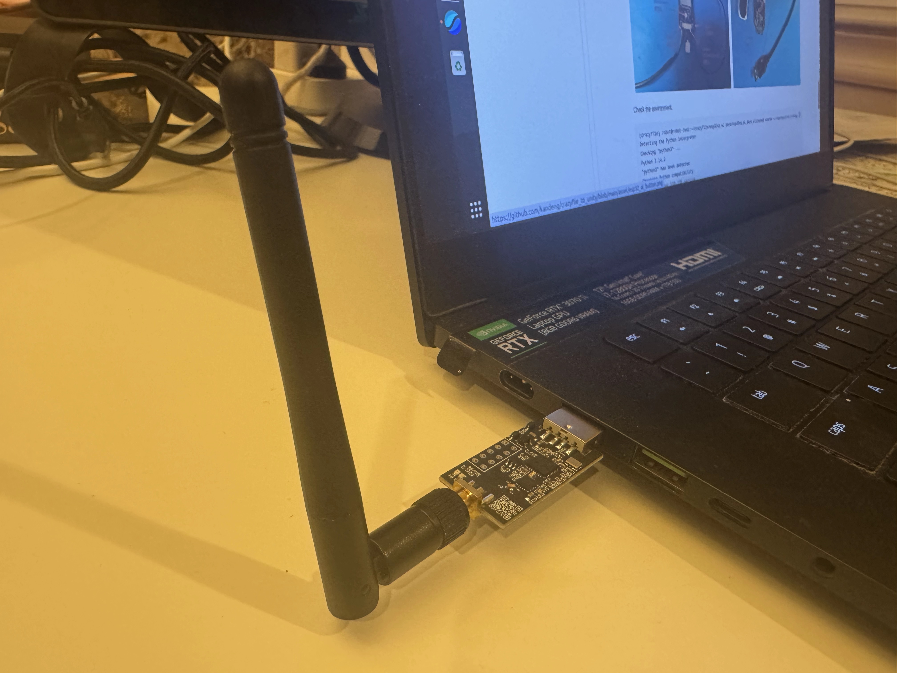
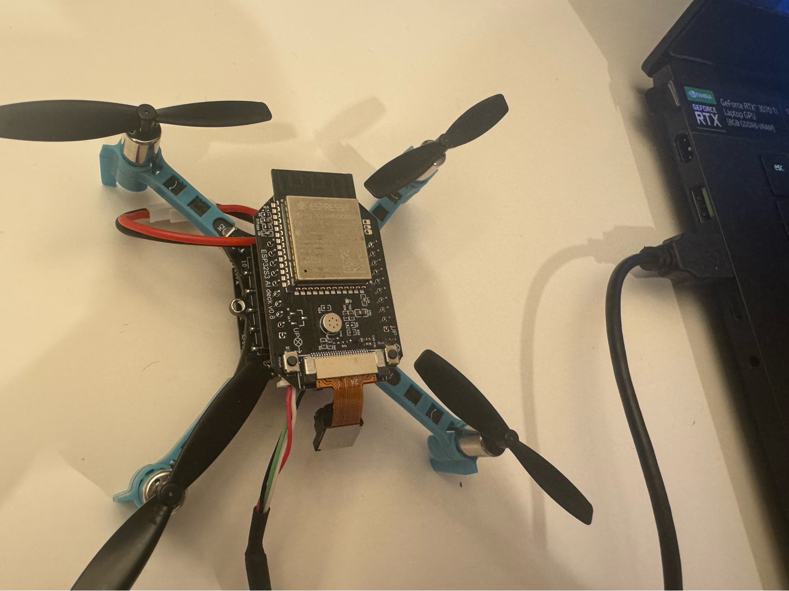
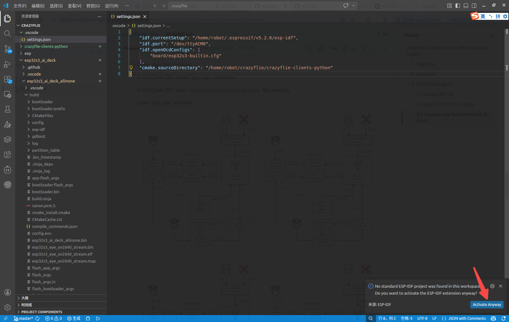
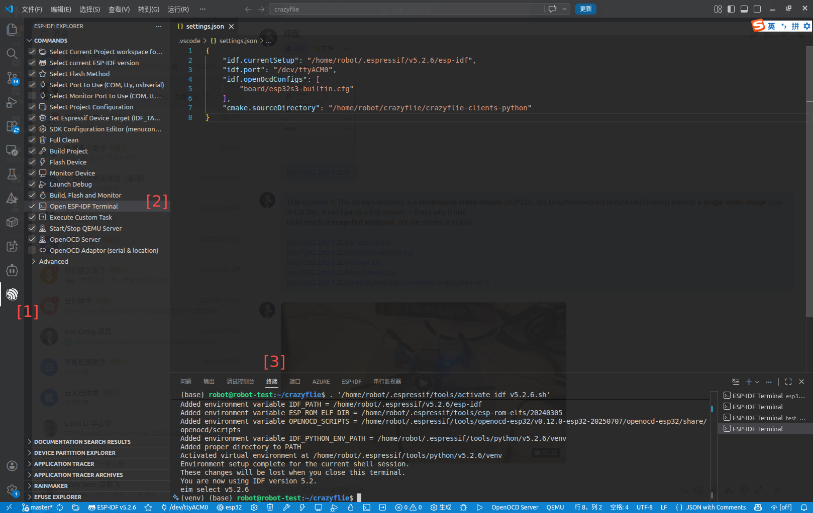
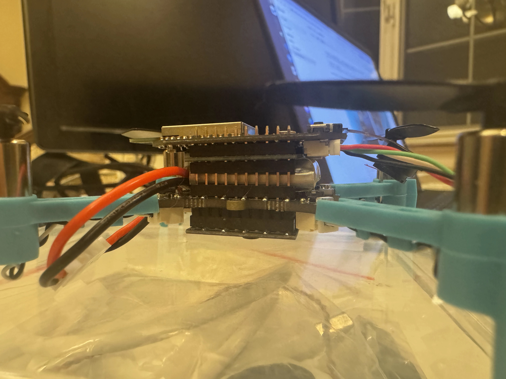
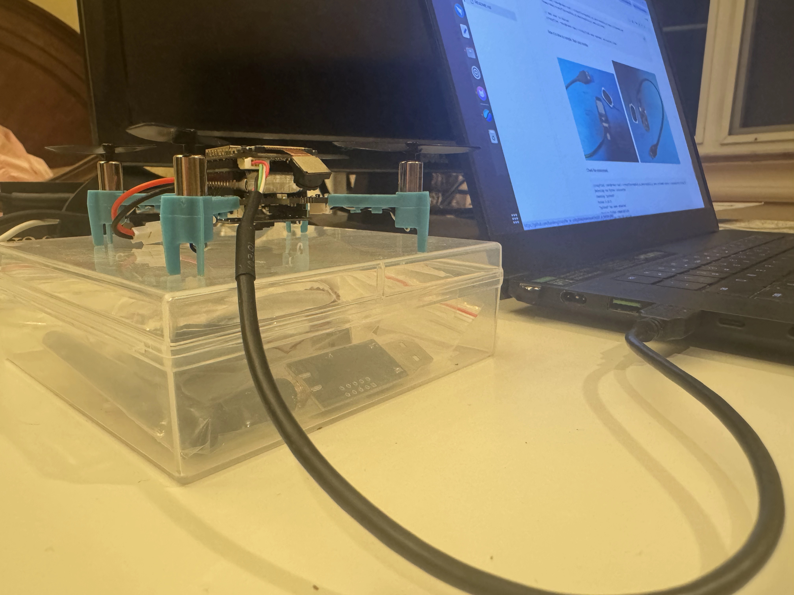
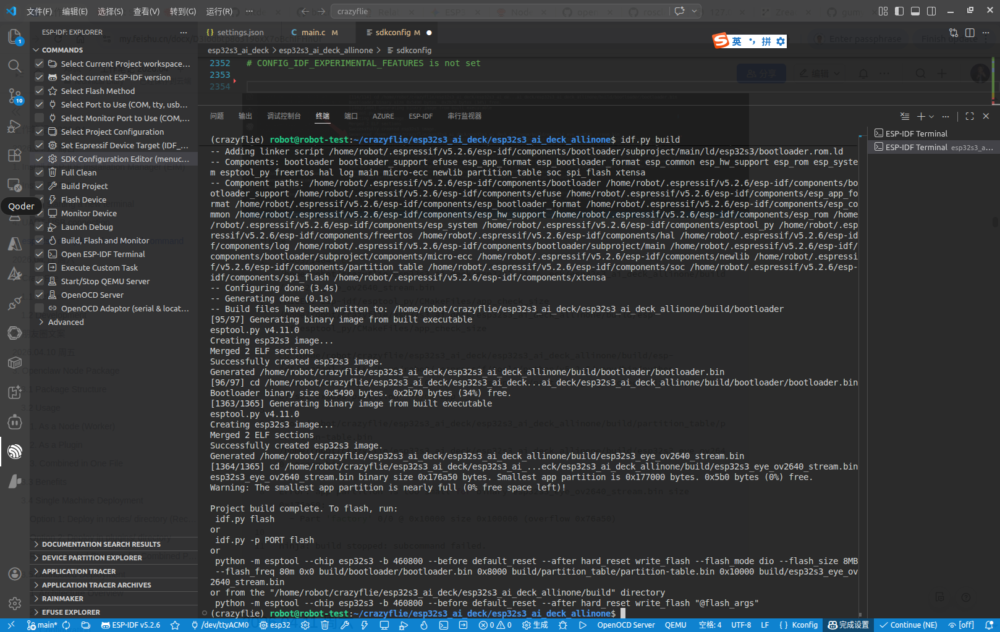
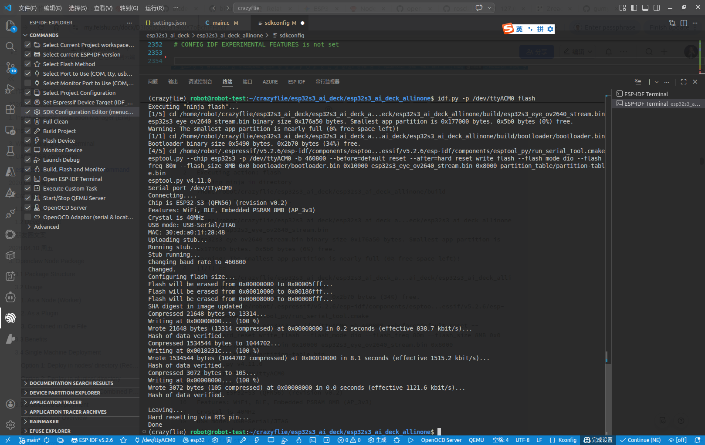

# Integrate Crazyflie Drone with Unity Game Engine

## 1. Objective

This project integrates [Crazyflie 2.1_drone](https://www.bitcraze.io/products/crazyflie-2-1-brushless/) 
with [Unity6 game engine](https://unity.com/releases/unity-6). 
We use Unity6 as the controller of the Crazyflie2.1, to receive the drone's telemetry and its video stream, 
and to send commands to control the movement of the drone. 

&nbsp;
## 2. Hardware

We bought a Crazyflie 2.1 hardware kit from 
[a Taobao store named DinosaurTech](https://item.taobao.com/item.htm?id=985921221709). 
The kit includes four components, with a total cost of US$230.

It is quite straightforward to [assemble the Crazyflie 2.1](https://www.bitcraze.io/documentation/tutorials/getting-started-with-crazyflie-brushless/), 
with well-written documentation. 

It is also very easy to use Python to use radio to 
[communicate with the Crazyflie 2.1](https://www.bitcraze.io/documentation/repository/crazyflie-lib-python/master/user-guides/sbs_connect_log_param/), 
and control its movement.

~~~
1 * crazyflie2.1
1 * flow deck for navigation
1 * crazyradio PA
1 * esp32s3_AI_deck
~~~

Left: The main board of crazyflie2.1 has two rows of pin headers on its top side.
Right: The flow deck for navigation is equipped with a camera and is mounted underneath the Crazyflie 2.1 main board.

   

     
     &nbsp;
     
   
  

Left: The crazyradio PA is the default communication channel between the crazyflie2.1 drone and computer. 
Right: The ESP32s3 AI Deck is plugged into the pin headers on top of the `Crazyflie2.1` main board.

   

     
     &nbsp;
     
   
  

&nbsp;
## 3. ESP32s3 AI Deck

While the native Crazyflie 2.1 setup (using Crazyradio PA and `cflib` python package) is user-friendly, it lacks video streaming capability and wifi connectivity.

[`ESP-Drone`](https://docs.espressif.com/projects/espressif-esp-drone/en/latest/gettingstarted.html)
provides a viable solution for Wi-Fi communication and video streaming. 
In addition, the Taobao store "DinosaurTech" offers an experimental accessory named 
[`ESP32-S3 AI Deck`](https://github.com/bitdeckai/esp32s3_ai_deck).

However, installing and configuring `ESP-Drone` and `ESP32-S3 AI Deck` is not straightforward.
We followed this procedure and finally got it working after several attempts.

&nbsp;
### 3.1 Install ESP-IDF

We followed the official guide to 
[install ESP32s3-IDF](https://docs.espressif.com/projects/esp-idf/en/stable/esp32s3/get-started/linux-setup.html)
in offline mode. 

1. Install `ESP-EIM`
   
   ~~~
   robot@robot-test:~$ uname -a
   Linux robot-test 6.8.0-110-generic #110~22.04.1-Ubuntu SMP PREEMPT_DYNAMIC Fri Mar 27 12:43:08 UTC  x86_64 x86_64 x86_64 GNU/Linux
   
   robot@robot-test:~$ echo "deb [trusted=yes] https://dl.espressif.com/dl/eim/apt/ stable main" | sudo tee /etc/apt/sources.list.d/espressif.list
   
   robot@robot-test:~$ sudo apt update
   robot@robot-test:~$ sudo apt install eim
   ~~~

2. Download `ESP-IDF` 
   
   Following the official guide to download the `archive_vv5.2.6_linux-x64.zst`.

3. Install `ESP-IDF`
   
   ~~~
   robot@robot-test:~$ eim install --use-local-archive /home/robot/crazyflie/archive_vv5.2.6_linux-x64.zst
   ...
   You have successfully installed ESP-IDF
   for using the ESP-IDF tools inside the terminal, you will find activation scripts inside the base install folder
   sourcing the activation script will setup environment in the current terminal session
   ============================================
   to activate the environment, run the following command in your terminal:
          source "/home/robot/.espressif/tools/activate_idf_v5.2.6.sh"
   ============================================
   ...
   ~~~

4. Setup `ESP-IDF` environment
   
   ~~~
   robot@robot-test:~/crazyflie$ pwd
   /home/robot/crazyflie
   
   robot@robot-test:~/crazyflie$ echo $ESP_IDF_VERSION
   <show nothing>
   
   robot@robot-test:~/crazyflie$ source "/home/robot/.espressif/tools/activate_idf_v5.2.6.sh"
   ...
   Added environment variable ESP_IDF_VERSION = 5.2
   Added environment variable IDF_TOOLS_PATH = /home/robot/.espressif/tools
   Added environment variable IDF_COMPONENT_LOCAL_STORAGE_URL = file:///home/robot/.espressif/tools
   Added environment variable IDF_PATH = /home/robot/.espressif/v5.2.6/esp-idf
   Added environment variable ESP_ROM_ELF_DIR = /home/robot/.espressif/tools/esp-rom-elfs/20240305
   Added environment variable OPENOCD_SCRIPTS = /home/robot/.espressif/tools/openocd-esp32/v0.12.0-esp32-20250707/openocd-esp32/share/openocd/scripts
   Added environment variable IDF_PYTHON_ENV_PATH = /home/robot/.espressif/tools/python/v5.2.6/venv
   Added proper directory to PATH
   Activated virtual environment at /home/robot/.espressif/tools/python/v5.2.6/venv
   Environment setup complete for the current shell session.
   These changes will be lost when you close this terminal.
   You are now using IDF version 5.2.
   eim select v5.2.6
   
   (venv) robot@robot-test:~/crazyflie$ deactivate
   robot@robot-test:~/crazyflie$ 
   
   robot@robot-test:~/crazyflie$ echo $ESP_IDF_VERSION
   5.2
   
   robot@robot-test:~/crazyflie$ echo $IDF_PATH
   /home/robot/.espressif/v5.2.6/esp-idf
   
   robot@robot-test:~/crazyflie$ echo $IDF_TOOLS_PATH
   /home/robot/.espressif/tools
   
   robot@robot-test:~/crazyflie$ echo $OPENOCD_SCRIPTS
   /home/robot/.espressif/tools/openocd-esp32/v0.12.0-esp32-20250707/openocd-esp32/share/openocd/scripts
   
   robot@robot-test:~/crazyflie$ echo $IDF_PYTHON_ENV_PATH
   /home/robot/.espressif/tools/python/v5.2.6/venv
   ~~~

5. Add user to dialout

   Following [the official guide of `ESP-IDF`](https://docs.espressif.com/projects/esp-idf/en/stable/esp32s3/get-started/establish-serial-connection.html#adding-user-to-dialout-or-uucp-on-linux),
   to add user to dialout

   ~~~
   robot@robot-test:~/crazyflie$ sudo usermod -aG dialout robot
   ~~~
   
6. Exit `venv` env and create `conda` env

   Exit from `venv` env after sourcing the `activate_idf_v5.2.6.sh`. 

   ~~~   
   robot@robot-test:~/crazyflie$ source "/home/robot/.espressif/tools/activate_idf_v5.2.6.sh"
   ...
   Activated virtual environment at /home/robot/.espressif/tools/python/v5.2.6/venv
   Environment setup complete for the current shell session.
   These changes will be lost when you close this terminal.
   You are now using IDF version 5.2.
   eim select v5.2.6
   
   (venv) robot@robot-test:~/crazyflie$ deactivate
   robot@robot-test:~/crazyflie$ 
   ~~~ 

   Create `conda` env. 

   ~~~
   robot@robot-test:~/crazyflie$ conda create --name crazyflie python=3.14
   robot@robot-test:~/crazyflie$ conda activate crazyflie

   (crazyflie) robot@robot-test:~/crazyflie/webrtc$ python --version
   Python 3.14.3
   ~~~

&nbsp;
### 3.2 Install ESP32-S3 AI Deck

Don't use PuTTY or the regular bash shell in the regular terminal, as they do not work for unknown reasons. 
Instead, use the `ESP-IDF` terminal in the `ESP-IDF` extension of VS-Code IDE.

1. Download `esp32s3_ai_deck` github repo

   We downloaded the source code from [`esp32s3_ai_deck`](https://github.com/bitdeckai/esp32s3_ai_deck) github repo,
   and stored it in `~/crazyflie` directory.  

   ~~~
   (crazyflie) robot@robot-test:~/crazyflie$ tree -L 1 esp32s3_ai_deck/
   esp32s3_ai_deck/
   ├── esp32s3_ai_deck_allinone
   ├── esp32s3_audio_i2s_es8311
   ├── esp32s3_camera_ov2640_stream
   ├── media
   ├── README.md
   ├── sch_pcb
   └── tools
   
   6 directories, 1 file
   ~~~

2. Open `ESP-IDF` terminal

   In VS-Code IDE, install `ESP-IDF` extension.

   In VS-Code IDE, open `~/crazyflie/esp32s3_ai_deck` file directory. 
  
   Open `ESP-IDF` terminal. 

   

     
     &nbsp;
     
   
     

3. Enter `ESP-IDF` environment

   All following commands are executed within the ESP-IDF terminal in the VS Code IDE.

   Exit `venv` env and activate `conda` env. 

   ~~~
   robot@robot-test:~/crazyflie$ source "/home/robot/.espressif/tools/activate_idf_v5.2.6.sh"
   
   (venv) robot@robot-test:~/crazyflie$ deactivate
   robot@robot-test:~/crazyflie$

   robot@robot-test:~/crazyflie$ conda activate crazyflie
   (crazyflie) robot@robot-test:~/crazyflie$
   ~~~

   Set Target to `esp32s3`.
   
   ~~~
   (crazyflie) robot@robot-test:~/crazyflie/esp32s3_ai_deck/esp32s3_ai_deck_allinone$ unset IDF_TARGET
   
   (crazyflie) robot@robot-test:~/crazyflie/esp32s3_ai_deck/esp32s3_ai_deck_allinone$ idf.py set-target esp32s3
   Adding "set-target"'s dependency "fullclean" to list of commands with default set of options.
   Executing action: fullclean
   Build directory '/home/robot/crazyflie/esp32s3_ai_deck/esp32s3_ai_deck_allinone/build' is empty. Nothing to clean.
   Executing action: set-target
   Set Target to: esp32s3, new sdkconfig will be created.
   Running cmake in directory /home/robot/crazyflie/esp32s3_ai_deck/esp32s3_ai_deck_allinone/build
   Executing "cmake -G Ninja -DPYTHON_DEPS_CHECKED=1 -DPYTHON=/home/robot/.espressif/tools/python/v5.2.6/venv/bin/python -DESP_PLATFORM=1 -DIDF_TARGET=esp32s3 -DCCACHE_ENABLE=0 /home/robot/crazyflie/esp32s3_ai_deck/esp32s3_ai_deck_allinone"...
   ...
   -- Configuring done (11.2s)
   -- Generating done (0.2s)
   -- Build files have been written to: /home/robot/crazyflie/esp32s3_ai_deck/esp32s3_ai_deck_allinone/build
   ~~~

&nbsp;
### 3.3 Compile and flash ESP32s3 AI Deck

1. Assemble hardware

   Plug the `ESP32s3 AI Deck` into the pin headers on top of the `Crazyflie2.1` main board.

   Plug the cable of the `ESP32s3 AI Deck` into the USB port of the ubuntu computer.

   After compiling and flashing the firmware of the `ESP32s3 AI Deck`,
   and before flying the crazyflie drone,
   make sure to unplug the cable from the `ESP32s3 AI Deck`.

   

     
     &nbsp;
     
   
  

2. Find the `tty` port

   Following [the official guide of ESP32s3](https://docs.espressif.com/projects/esp-idf/en/stable/esp32s3/get-started/establish-serial-connection.html#check-port-on-linux-and-macos),
   run this command two times, first with the cable unplugged, then with plugged into the USB port.
   
   The `tty` port which appears the second time is the one we need.
   In our case, the crazyflie's `tty` port is `/dev/ttyACM0`.

   ~~~
   (crazyflie) robot@robot-test:~/crazyflie$ ls /dev/tty*
   /dev/tty ... /dev/ttyACM0 
   ~~~
   

3. Compiling, monitoring, and flashing

   Following the instruction of [`ESP32s3 AI Deck`](https://github.com/bitdeckai/esp32s3_ai_deck#esp32s3-compile-and-download-command),
   execute the following commands within the ESP-IDF terminal in the VS Code IDE.

   In case you haven't added the user to dialout, please do it.

   ~~~
   (crazyflie) robot@robot-test:~/crazyflie/esp32s3_ai_deck/esp32s3_ai_deck_allinone$ pwd
   /home/robot/crazyflie/esp32s3_ai_deck/esp32s3_ai_deck_allinone
  
   // Add user to dialout
   (crazyflie) robot@robot-test:~/crazyflie$ sudo usermod -aG dialout robot
   ~~~

   Now it is time to compile, flash and monitor.

   

     
     &nbsp;
     
   
  

   Check the environment. 

   ~~~
   (crazyflie) robot@robot-test:~/crazyflie/esp32s3_ai_deck/esp32s3_ai_deck_allinone$ source ~/.espressif/v5.2.6/esp-idf/export.sh
   Detecting the Python interpreter
   Checking "python3" ...
   Python 3.14.3
   "python3" has been detected
   Checking Python compatibility
   Checking other ESP-IDF version.
   ~~~

   Clean up the compilation platform. 
   
   ~~~
   (crazyflie) robot@robot-test:~/crazyflie/esp32s3_ai_deck/esp32s3_ai_deck_allinone$ idf.py fullclean
   Executing action: fullclean
   <ignore the errors>
   ~~~

   Set target to `esp32s3`.
   
   ~~~
   (crazyflie) robot@robot-test:~/crazyflie/esp32s3_ai_deck/esp32s3_ai_deck_allinone$ unset IDF_TARGET
   (crazyflie) robot@robot-test:~/crazyflie/esp32s3_ai_deck/esp32s3_ai_deck_allinone$ idf.py set-target esp32s3
   ~~~

   Compile.
   
   ~~~
   (crazyflie) robot@robot-test:~/crazyflie/esp32s3_ai_deck/esp32s3_ai_deck_allinone$ idf.py menuconfig
   <In most cases, we don't need to change anything>

   (crazyflie) robot@robot-test:~/crazyflie/esp32s3_ai_deck/esp32s3_ai_deck_allinone$ idf.py build
   ~~~

   Flash and monitor.

   Referring to the image above, push the `Boot` button, hold it then push `Reset` button,
   check the tty port, then run `flash`.

   ~~~
   // push the `Boot` button, hold it then push `Reset` button, 
   (crazyflie) robot@robot-test:~/crazyflie/esp32s3_ai_deck/esp32s3_ai_deck_allinone$ idf.py -p /dev/ttyACM0 flash

   // monitor UART with baut rate 115200 for ESP32s3.
   (crazyflie) robot@robot-test:~/crazyflie/esp32s3_ai_deck/esp32s3_ai_deck_allinone$ idf.py -p /dev/ttyACM0 monitor

   // do flashing and UART monitoring simultaneously. 
   (crazyflie) robot@robot-test:~/crazyflie/esp32s3_ai_deck/esp32s3_ai_deck_allinone$ idf.py -p /dev/ttyACM0 flash monitor
   ~~~
   
   

     
     &nbsp;
     
   
     
